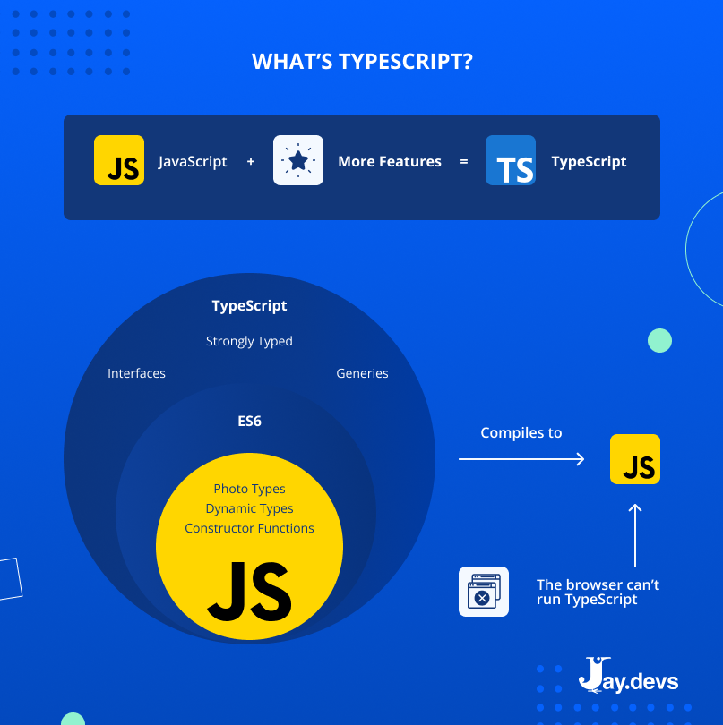

# Introduction to TypeScript

TypeScript is an open-source programming language developed and maintained by Microsoft. It is a statically-typed superset of JavaScript, which means it extends and enforces JavaScript by adding static type checking to the language. TypeScript is designed to make it easier to build large, complex software systems by providing features that help catch and prevent common programming errors during development.

  

Here are some key features and concepts associated with TypeScript:

1. **Static Typing:** TypeScript introduces a static type system that allows developers to specify the types of variables, function parameters, and return values. This type checking helps catch type-related errors at compile-time, rather than runtime, which can lead to more robust and maintainable code.

2. **Type Inference:** TypeScript can often infer types without explicit annotations, making it less verbose than some other statically-typed languages. This can reduce the need for explicit type declarations in many cases.

3. **Interfaces and Classes:** TypeScript supports object-oriented programming concepts like classes and interfaces. You can define classes and interfaces with strongly-typed properties and methods, making it easier to work with complex data structures.

4. **Module System:** TypeScript uses a module system to help organize and encapsulate code. This is particularly important for building larger applications with many files and dependencies.

5. **Compatibility with JavaScript:** TypeScript is a superset of JavaScript, which means that you can gradually migrate existing JavaScript codebases to TypeScript. You can use existing JavaScript libraries and frameworks in TypeScript projects, and TypeScript can interoperate with JavaScript seamlessly.

6. **Rich Tooling:** TypeScript has excellent tooling support, including integrated development environments (IDEs) like Visual Studio Code that provide autocompletion, error checking, and refactoring assistance.

7. **Compiler:** TypeScript code is transpiled (converted) into standard JavaScript using the TypeScript compiler. This transpilation process ensures that TypeScript code can run on any JavaScript runtime, including browsers and Node.js.

8. **Community and Ecosystem:** TypeScript has a thriving community and a growing ecosystem of third-party libraries and frameworks that support TypeScript, making it increasingly popular for web and application development.

TypeScript is widely used for web development, and it has gained popularity in other domains as well. It helps developers write safer and more maintainable code by catching errors early in the development process while still benefiting from the dynamic nature of JavaScript at runtime.
